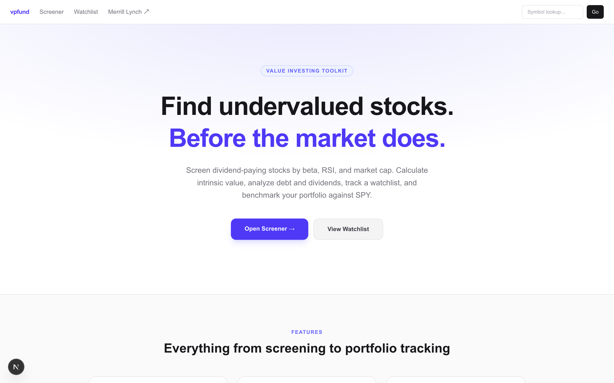
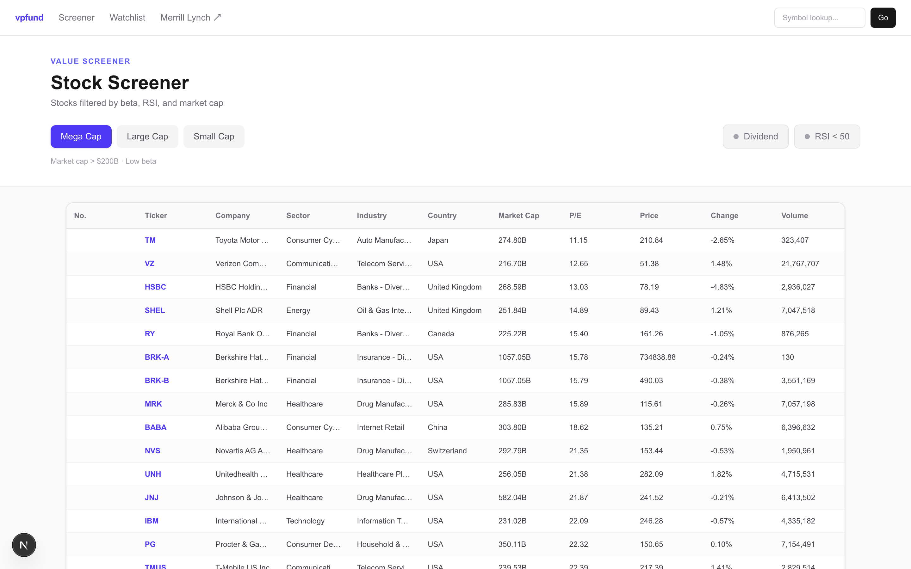
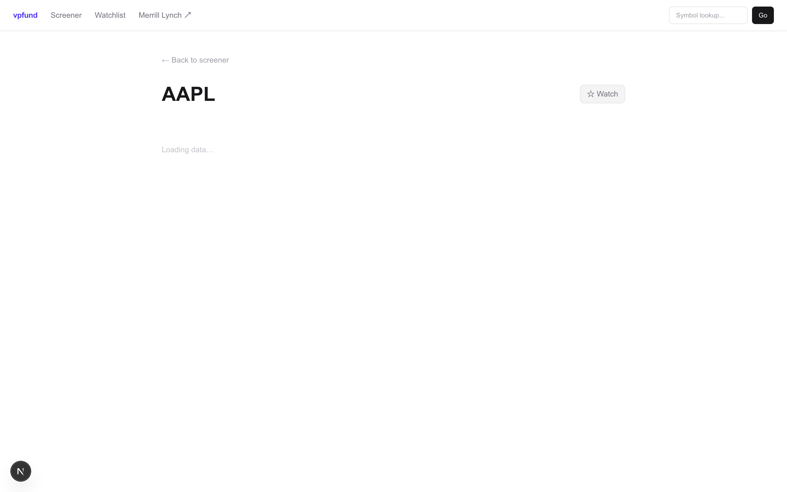
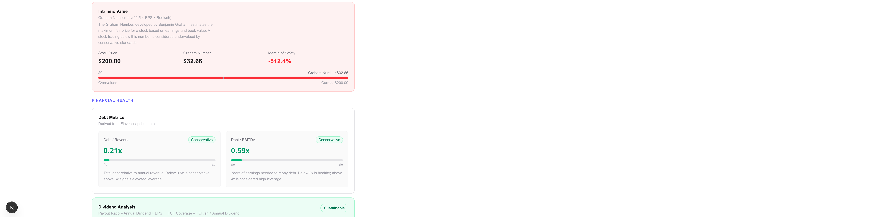
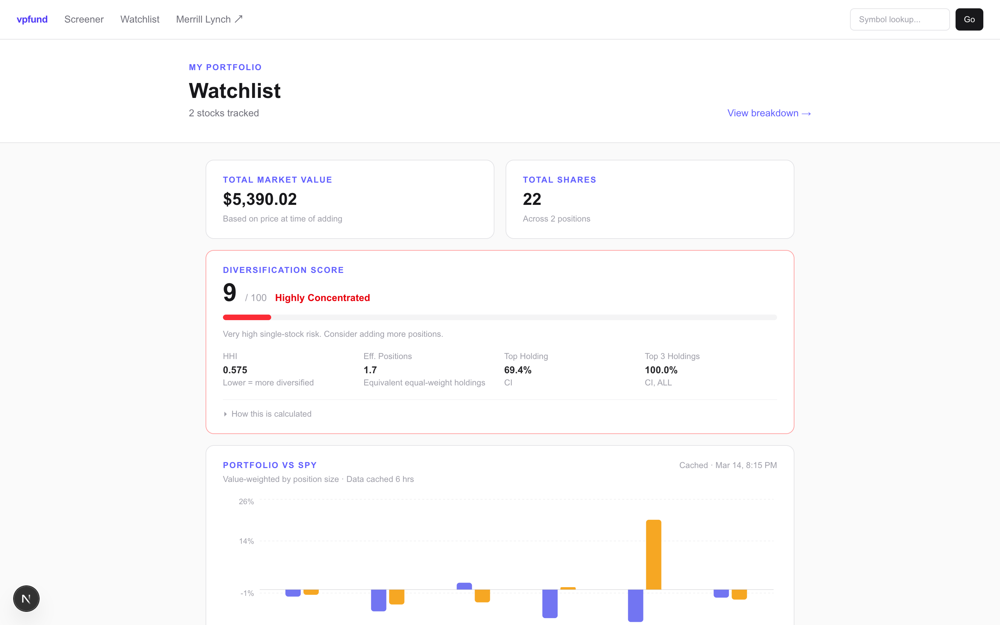
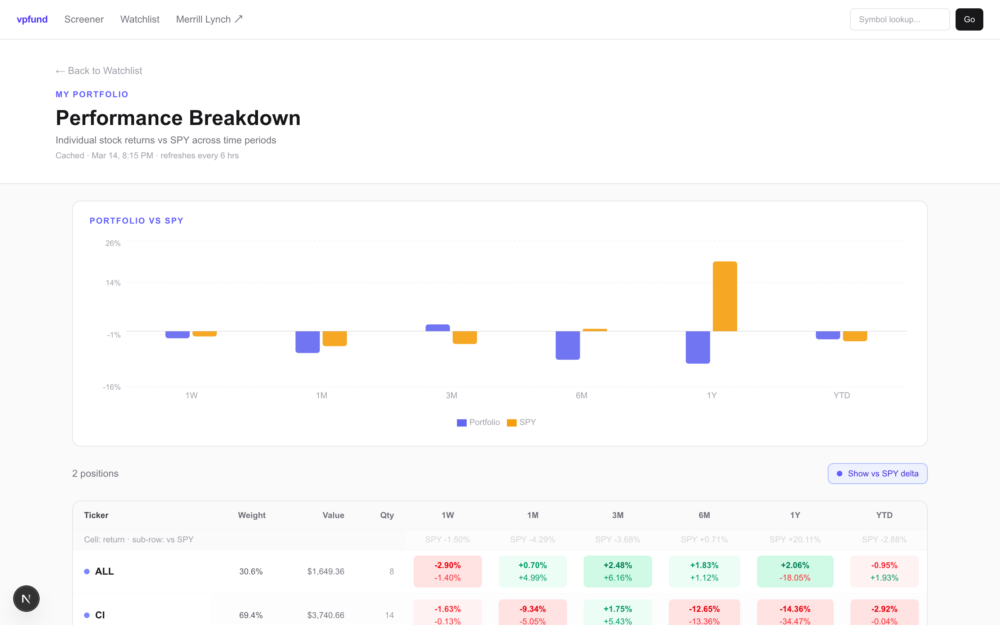
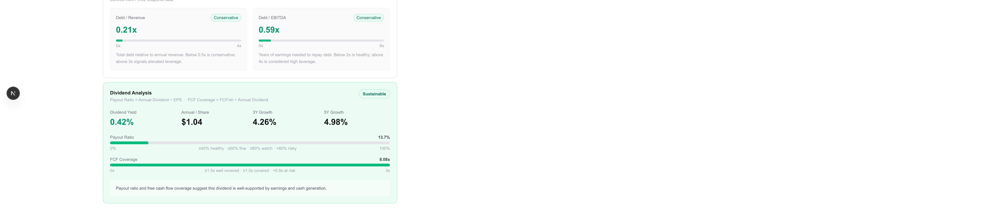

<div align="center">

# vpfund

**A self-hosted value investing toolkit — screen stocks, track a watchlist, and measure portfolio performance vs SPY.**

[](https://nextjs.org)
[](https://react.dev)
[](https://www.typescriptlang.org)
[](https://tailwindcss.com)
[](https://tanstack.com/table)

</div>

---

## Screenshots

| Landing Page | Stock Screener |
|:---:|:---:|
|  |  |

| Stock Detail | Intrinsic Value |
|:---:|:---:|
|  |  |

| Watchlist | Performance Breakdown |
|:---:|:---:|
|  |  |



---

## What is vpfund?

vpfund is a self-hosted stock research tool built for value investors. Screen dividend-paying stocks across market cap tiers, calculate the **Graham Number**, analyze leverage, and track a personal watchlist — all backed by a local SQLite database and scraped in real time from Finviz and Reuters.

No subscriptions. No API keys. No paywalls.

---

## Features

### Stock Screener
- Three market cap tiers — **Mega Cap** (>$200B), **Large Cap** ($10B–$200B), **Small Cap** ($300M–$2B)
- Pre-filtered for **dividend-paying** stocks with **low beta** and **RSI below 50** (oversold value candidates)
- Sortable columns via TanStack Table with **20-record pagination**
- URL-persisted tab and page state — hitting browser back restores exactly where you were
- Click any ticker to open its detail page — price passes through the URL for instant display

### Intrinsic Value (Graham Number)
- Calculates `√(22.5 × EPS × Book/sh)` for every stock using live Finviz data
- Shows **Stock Price**, **Graham Number**, and **Margin of Safety** side by side
- Color-coded card — green when undervalued, red when overvalued
- Progress bar showing where the current price sits relative to fair value

### Debt Metrics
- **Debt / Revenue** derived from `Debt/Eq × Book/sh × Shares Outstanding ÷ Sales`
- **Debt / EBITDA** derived from `Total Debt ÷ (Enterprise Value ÷ EV/EBITDA)`
- Four-tier risk badge per metric: `Conservative` · `Moderate` · `Elevated` · `High Leverage`
- Animated progress bars scaled to meaningful thresholds

### Stock Detail Page
- Price, company description (always sourced from Finviz for consistency)
- Income Statement, Balance Sheet, and Cash Flow from Finviz snapshot stats
- Supplementary financial tables from Reuters when available

### Symbol Lookup
- Search any ticker from the navbar — independent of the screener
- Navigates directly to the stock detail page with all metrics populated

### Watchlist
- Add any stock to your watchlist directly from the detail page with one click
- Enter share quantities to track **position size** and **total market value**
- Inline quantity editing — type and press Enter or click away to save
- Persisted to a local **SQLite** database via `better-sqlite3`

### Portfolio vs SPY Performance
- Compares your watchlist portfolio against the **SPY benchmark** across 6 time periods: 1W, 1M, 3M, 6M, 1Y, YTD
- **Value-weighted** by position size when quantities are set; falls back to equal-weight
- Results cached in SQLite for 6 hours — recalculated on each page visit after cache expires
- Grouped bar chart (Portfolio in indigo, SPY in amber) with a custom hover tooltip

### Performance Breakdown
- Per-stock heatmap table — each row is a position, each column a time period
- Cells color-coded by return magnitude (two shades of green/red)
- Toggle **vs SPY delta** to show how each stock beats or lags the benchmark per period
- Sortable by any period or portfolio weight
- SPY benchmark row pinned at the bottom for direct comparison

### Diversification Score
- Calculates a **0–100 score** using the Herfindahl-Hirschman Index (HHI)
- Shows **HHI**, **Effective Number of Positions (ENP)**, top holding %, and top-3 concentration %
- Four verdicts: Well Diversified · Moderately Diversified · Concentrated · Highly Concentrated
- Collapsible formula explanation with step-by-step breakdown inline on the page

---

## Tech Stack

| Layer | Technology |
|---|---|
| Framework | Next.js 16 (App Router) |
| Language | TypeScript 5 |
| Styling | Tailwind CSS v4 |
| Table | TanStack Table v8 |
| Charts | Recharts |
| Scraping | Cheerio (server-side) |
| Database | SQLite via better-sqlite3 |
| Data Sources | Finviz, Reuters |
| Runtime | Node.js 22 |
| Package Manager | pnpm |

---

## Getting Started

### Prerequisites

This project requires **Node.js 22** and **pnpm**. Follow the steps for your OS.

---

#### macOS / Linux

**1. Install nvm**

```bash
curl -o- https://raw.githubusercontent.com/nvm-sh/nvm/v0.40.3/install.sh | bash
```

Restart your terminal, then:

```bash
nvm install 22
nvm use 22
node --version  # v22.x.x
```

**Auto-switching (recommended):** Add to your `~/.zshrc` (zsh) or `~/.bash_profile` (bash):

```bash
export NVM_DIR="$HOME/.nvm"
[ -s "$NVM_DIR/nvm.sh" ] && \. "$NVM_DIR/nvm.sh"

# zsh only — auto-switch node version on cd
autoload -U add-zsh-hook
load-nvmrc() {
  local nvmrc_path="$(nvm_find_nvmrc)"
  if [ -n "$nvmrc_path" ]; then
    local nvmrc_node_version=$(nvm version "$(cat "${nvmrc_path}")")
    if [ "$nvmrc_node_version" != "$(nvm version)" ]; then
      nvm use --silent
    fi
  fi
}
add-zsh-hook chpwd load-nvmrc
load-nvmrc
```

With this in place, `cd vpfund` will automatically switch to Node 22.

---

#### Windows

**1. Install nvm-windows**

Download and run the installer from [github.com/coreybutler/nvm-windows/releases](https://github.com/coreybutler/nvm-windows/releases) (`nvm-setup.exe`).

Open a new terminal (PowerShell or CMD as Administrator), then:

```powershell
nvm install 22
nvm use 22
node --version  # v22.x.x
```

> **Windows build tools:** `better-sqlite3` compiles a native module. You may need to install build tools first:
> ```powershell
> npm install -g windows-build-tools
> ```
> Or install [Visual Studio Build Tools](https://visualstudio.microsoft.com/visual-cpp-build-tools/) and select **"Desktop development with C++"**.

---

**2. Install pnpm (all platforms)**

```bash
npm install -g pnpm
```

### Install & Run

```bash
# Clone the repo
git clone https://github.com/your-username/vpfund.git
cd vpfund

# Install dependencies (ensure Node 22 is active first)
pnpm install

# Start the dev server
pnpm dev
```

Open [http://localhost:3000](http://localhost:3000).

> **Note:** The project enforces Node 22+ via `.npmrc`. Running `pnpm install` with an older Node version will fail with a clear error.

---

## Project Structure

```
vpfund/
├── app/
│   ├── page.tsx                         # Marketing landing page
│   ├── screener/
│   │   └── page.tsx                     # Stock screener (Mega/Large/Small cap tabs)
│   ├── stocks/
│   │   └── [ticker]/
│   │       └── page.tsx                 # Stock detail page
│   ├── watchlist/
│   │   ├── page.js                      # Watchlist with market value + diversification score
│   │   └── performance/
│   │       └── page.js                  # Per-stock performance breakdown vs SPY
│   ├── api/
│   │   ├── stocks/
│   │   │   ├── route.ts                 # Finviz screener endpoint
│   │   │   └── [ticker]/quote/
│   │   │       └── route.ts             # Quote + intrinsic value + debt metrics
│   │   ├── watchlist/
│   │   │   └── route.js                 # GET / POST / PATCH / DELETE watchlist
│   │   └── performance/
│   │       └── route.ts                 # Portfolio vs SPY performance (6hr cached)
│   └── components/
│       ├── NavBar.tsx                   # Sticky nav with symbol search
│       ├── SymbolSearch.tsx             # Ticker lookup input
│       ├── StocksTable.tsx              # Sortable, paginated screener table
│       ├── StockDetail.tsx              # Stock detail orchestrator
│       ├── IntrinsicValue.tsx           # Graham Number card with progress bar
│       ├── DebtMetrics.tsx              # Debt/Revenue + Debt/EBITDA cards
│       ├── DividendMetrics.tsx          # Dividend sustainability analysis
│       ├── WatchlistButton.tsx          # Add/remove watchlist toggle
│       ├── PerformanceChart.tsx         # Recharts grouped bar chart (Portfolio vs SPY)
│       └── DiversificationScore.tsx     # HHI-based diversification card
├── lib/
│   └── db.js                            # SQLite singleton (better-sqlite3)
```

---

## How Intrinsic Value is Calculated

The **Graham Number** is a formula by Benjamin Graham estimating the maximum fair price of a stock:

```
Graham Number = √(22.5 × EPS (ttm) × Book Value per Share)
```

**Margin of Safety** measures how far the current price is below that fair value:

```
Margin of Safety = (Graham Number − Price) / Graham Number × 100
```

A positive margin means the stock trades **below** intrinsic value — a classic value signal.

---

## How Debt Metrics are Calculated

All inputs come from the Finviz snapshot table:

```
Total Equity   = Book/sh × Shares Outstanding
Total Debt     = Debt/Eq × Total Equity

Debt / Revenue = Total Debt ÷ Sales
Debt / EBITDA  = Total Debt ÷ (Enterprise Value ÷ EV/EBITDA)
```

---

## Data Sources

| Source | Used For |
|---|---|
| [Finviz](https://finviz.com) | Price, stats, description, screener results, debt inputs |
| [Reuters](https://reuters.com) | Supplementary financial statement tables |

> Data is scraped in real time on each request. This tool is for personal/informational use only and is not financial advice.

---

## How Diversification is Calculated

```
wᵢ     = (price × quantity) / total portfolio value
HHI    = Σ wᵢ²
ENP    = 1 / HHI
Score  = min(ENP / 20, 1) × 100
```

A portfolio of 20 perfectly equal positions scores **100**. A single position scores **5**. Falls back to equal-weighting if no quantities are set.

---

## Roadmap

- [ ] Financial charts (revenue, earnings, cash flow over time)
- [ ] DCF calculator
- [ ] Export watchlist to CSV
- [ ] Price refresh on watchlist (update stored price to current)

---

<div align="center">

**vpfund** · Built for value investors · For informational purposes only

</div>
